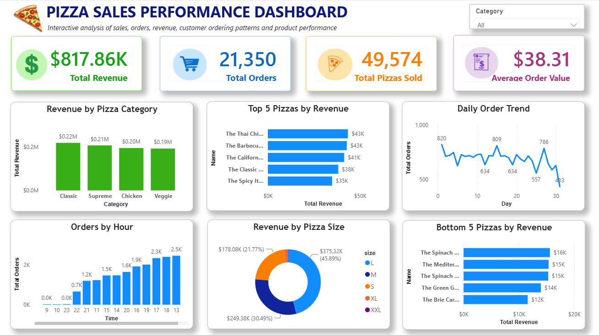

🍕 **Pizza Sales Analysis Dashboard**

An end-to-end Pizza Sales Analysis project based on pizza order data to analyze sales performance and identify useful business insights across products, categories, sizes, and ordering trends.

The project includes relational database creation, SQL analysis, DAX measures, and an interactive Power BI dashboard.

---

📷 **Dashboard Preview**

---

🎯 **Project Objective**

The objective of this project was to analyze pizza sales data using SQL and Power BI and find useful insights about sales, products, categories, and ordering trends.

---

🛠️ **Tools & Technologies**

- MySQL – Database creation and data storage
- SQL – Data validation and business analysis
- Power BI – Interactive dashboard and data visualization
- DAX – KPI and dashboard measures

---

🗄️ **Database Design**

I created a relational database named "pizza_sales_db" with four related tables:

1. Orders

Contains:

- Order ID
- Order Date
- Order Time

2. Order Details

Contains:

- Order Details ID
- Order ID
- Pizza ID
- Quantity

3. Pizzas

Contains:

- Pizza ID
- Pizza Type ID
- Size
- Price

4. Pizza Types

Contains:

- Pizza Type ID
- Pizza Name
- Category
- Ingredients

The tables are connected using primary keys and foreign keys.

---

🔍 **SQL Analysis**

I performed data validation and analyzed the sales data using 20 SQL business questions.

Data Validation

I checked:

- Total row counts
- Duplicate primary keys
- NULL values
- Date ranges
- Quantity ranges
- Price ranges

SQL Techniques Used

- "COUNT()"
- "SUM()"
- "AVG()"
- "MIN()"
- "MAX()"
- "COUNT(DISTINCT)"
- "GROUP BY"
- "HAVING"
- "ORDER BY"
- "JOIN"
- Subquery
- CTE
- Window Functions
- "ROW_NUMBER()"
- "LAG()"
- SQL View

Business Analysis Examples

- Total number of orders
- Total pizzas sold
- Number of pizza types
- Most expensive and cheapest pizza
- Number of pizza sizes and categories
- Orders by day
- Orders by hour
- Total revenue
- Average Order Value
- Top-selling pizzas by quantity
- Top 5 pizzas by revenue
- Revenue by pizza category
- Revenue by pizza size
- Pizzas priced above average
- Top-selling pizza in each category
- Daily revenue compared with the previous day
- Creation of a sales analysis view

---

📊 **Power BI Dashboard**

I created an interactive Pizza Sales Performance Dashboard in Power BI.

KPI Cards

- 💰 Total Revenue
- 🛒 Total Orders
- 🍕 Total Pizzas Sold
- 📊 Average Order Value

Dashboard Visuals

- Revenue by Pizza Category
- Top 5 Pizzas by Revenue
- Bottom 5 Pizzas by Revenue
- Daily Order Trend
- Orders by Hour
- Revenue by Pizza Size
- Category Slicer

---

🧮 **DAX**

I created DAX measures for the main dashboard KPIs, including:

- Total Revenue
- Total Orders
- Total Pizzas Sold
- Average Order Value

These measures are used in the Power BI dashboard to display the key sales metrics dynamically based on the selected filters.

---

💡 **Key Insights**

The analysis helped identify:

- Classic category generated the highest revenue.
- Large pizza size contributed the highest revenue.
- Ordering activity was higher during specific peak hours.
- The analysis identified the top 5 and bottom 5 pizzas by revenue.
- Daily order trends helped identify changes in ordering activity over time.

---

📁 **Project Files**

File                             |                Description
"orders.csv"                     |                Orders dataset
"order_details.csv"              |                Order details dataset
"pizzas.csv"                     |                Pizza information dataset
"pizza_types.csv"                |                Pizza type and category information
"Pizza_Sales_Analysis.sql"       |                Database creation, validation, and SQL analysis
"Pizza_Sales_Analysis.pbix"      |                Power BI dashboard
"Dashboard.png"                  |                Dashboard preview

---

🔄 **Project Workflow**

Pizza Sales Data

↓

MySQL Relational Database

↓

Data Validation

↓

SQL Business Analysis

↓

DAX Measures

↓

Power BI Dashboard

↓

Business Insights

---

👩‍💻 **Author**

Lovely Goyal

Aspiring Data Analyst

Skills: SQL • MySQL • Power BI • DAX • Data Analysis • Data Visualization • Business Intelligence
